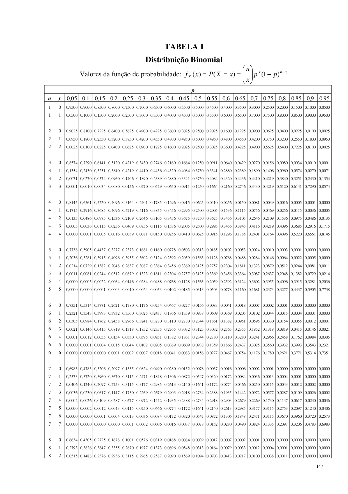
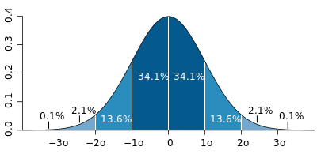
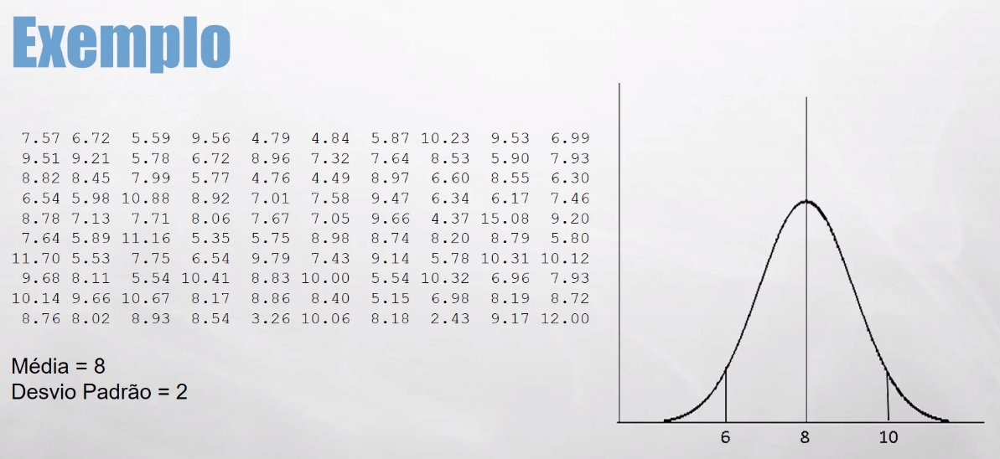
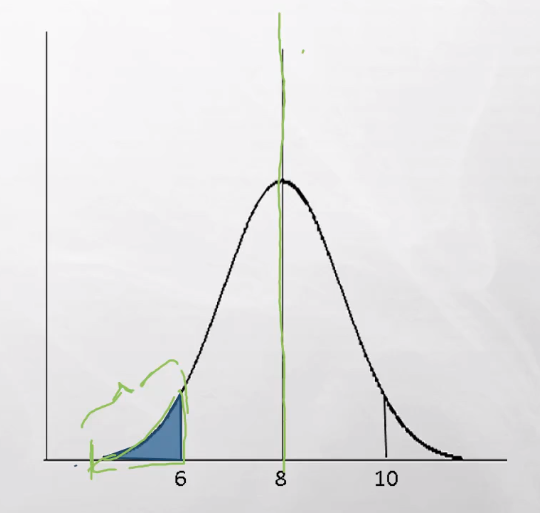
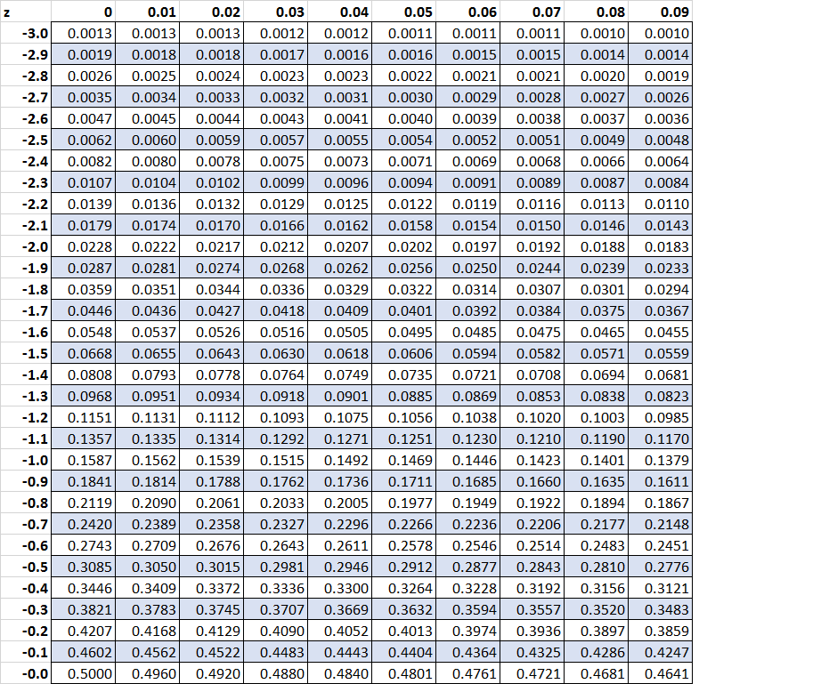
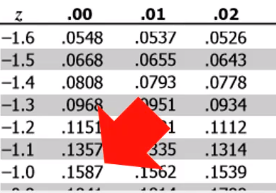
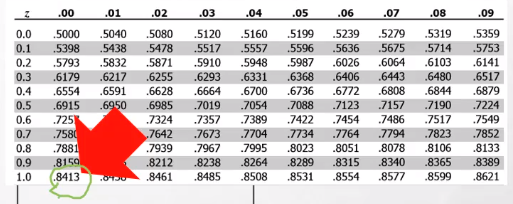

# Distribuição

- Usado principalmente na teoria da probabilidade
- Comportamento de dados aleatórios

*Exemplo 1*:

Variáveis = [12, 9, 10, 11, 8, 9, 10, 11, 10]

Um gráfico de frequência mostra a quantidade de vezes que dado número se repetiu.

A amostra apresentada acima, ficaria com um gráfico mais ou menos assim:

```R
4.______________
3._____10_______
2.___9_10_11____
1._8_9_10_11_12_
```

Podemos descobrir por exemplo, que existe uma maior frequência de dados ao redor da média (conhecida como Distribuição Normal)

Ainda sobre os dados descobrimos que:

1. 68% dos dados estão a +-1 desvio padrão da média
2. 30% dos dados estão a +-2 desvio padrão da média
3. e etc...

## Distribuição Binomial

É uma distribuição de probabilidade discreta

### Pré requisitos

1. Número fixo de experimentos.
2. Cada experimento pode ter 2 resultados apenas: Sucesso ou Fracasso.
3. A probabilidade de sucesso deve ser a mesma em cada experimento.
4. Os experimentos são independentes.

*Exemplo 1*:

Se eu jogar uma moeda 5 vezes. Qual a probabilidade de dar cara 3 vezes?

1. Número fixo de experimentos. *SIM*
2. Cada experimento pode ter 2 resultados apenas: Sucesso ou Fracasso. *SIM*
3. A probabilidade de sucesso deve ser a mesma em cada experimento. *SIM*
4. Os experimentos são independentes. *SIM*

*Exemplo 2*:

Um cesto tem 10 frutas que pesam entre 3 e 5 quilos. Qual a probabilidade de eu retirar duas frutas, uma de 4 quilos e outra de 3 quilos?

1. Número fixo de experimentos. *SIM*
2. Cada experimento pode ter 2 resultados apenas: Sucesso ou Fracasso. *NÃO*
3. A probabilidade de sucesso deve ser a mesma em cada experimento. *NÃO*
4. Os experimentos são independentes. *NÃO*

Logo eu não posso resolver esse problema utilizando distribuição Binomial

### Convenções

1. X = Total de sucesso esperado do experimento
2. p = probabilidade de sucesso
3. n = número de experimentos
4. 1-p = probabilidade de fracassos

### Fórmula

f(x) = $\binom{n}{x}p^x(1-p)^{(n-x)}$

#### Exemplo 1

Se eu jogar uma moeda 5 vezes. Qual a probabilidade de dar cara 3 vezes?

- X = 3
- p = 0,5
- n = 5

```R
*Fórmula*
f(x) = $\binom{n}{x}p^x(1-p)^{(n-x)}$

*Colocando os valores na Fórmula*
f(x) = $\binom{5}{3}(0,5)^3(1-0,5)^{(5-3)}$

*Calculando o binomio utilizando fatoriais para 5 e 3*
$\binom{n}{x} = \binom{5}{3} = \frac{5!}{3!(5-3)!} = \frac{120}{12}$ = 10

*Jogando o binomio calculado na formula*
$f(x) = 10 * (0,5)^3 * (1 - 0.5)^{(5-3)}$

*Resolvendo $p^x$*
$f(x) = 10 * 0.125 * (1 - 0.5)^{(5-3)}$

*Resolvendo as multiplicações*
$f(x) = 1.25 * (0,5)^2$

*Resolvendo a potência*
$f(x) = 1.25 * 0,25$

*Resultado*
$f(x) = 0,3125$
ou
$31.25%$
```

#### Exemplo 2

Se eu passar 4 sinais de quatro tempos cada. Qual a probabilidade de eu pegar: [0, 1, 2, 3 e 4] sinais verdes?

- X = 0, 1, 2, 3, 4
- p = 0.25
- n = 4

```R
Resultados

[0] = 0.316406 ou 31.64%
[1] = 0.421875 ou 42.18%
[2] = 0.210938 ou 21.09%
[3] = 0.046875 ou 04.68%
[4] = 0.003906 ou 00.39%
```

### Exemplo 3

Se você fizer a prova de um concurso com 12 questões de múltipla escolha (4 alternativas cada questão). "Chutando" todas as quesões, qual a probabilidade de acertar 7 questões?

- X = 7 acertos
- p = 0,25
- n = 12

```R
Resultado: 0.01147127 ou 1.14%
```

### Tabela de Distribuição



## Distribuição Normal

É uma distribuição em que a média dos dados se encontram ao centro, ou seja você deve encontrar praticamente a mesma quantidade de dados acima e abaixo da média.



*Outras características*:

1. 68.2% dos dados estão a até 1 desvio padrão da média
2. 27.2% dos dados estão entre 1 e 2 desvios padrão da média
3. 4,2% dos dados estão entre 2 e 3 desvios padrão da média
4. Acima de 3 desvios padrão da média apenas 0,4% dos dados
5. Possui o formato de "Sino"

### Teorema central do limite

- Supondo que você jogo um dado 100 vezes e calcule a média;
- repete esse processo mais 100 vezes sempre calculando a média.
- Independente de como os dados do lançamentos estão dispostos a cada execução a média. A média dos lançamentos sempre estará próximo a uma distribuição normal.

Ou colocando em termos mais complicados:

- Conforme o tamanho da amostra aumenta, a distribuição das médias amostrais se aproxima cada vez mais da distribuição normal
- Independente de como os dados estão distribuídos, suas médias estarão normalmente distribuídas

*Nota*:

- Graças ao teorema central do limite, você pode usar a distribuição normal para resolver diversos problemas, quando a distribuição dos dados é contínua.
- Para outros casos, como quando a amostra é menor que 30 ou você não sabe o desvio padrão, você pode usar uma outra distribuição: t-student.

### Exemplo



### Distribuição Normal Padrão [Z]

1. Mostra o número de desvios padrões que o valor está acima ou abaixo da média (score z ou valor z)
2. Média Zero
3. Desvio Padrão 1
4. Usa-se uma fórmula para calcular a probabilidade de seus dados com relação a tabela Z :
    **$Z = \frac{X - \mu}{\sigma}$**
5. Serve para fazer um de-para da sua distribuição para a Distribuição Normal Padrão. Ou seja, Normalizar a sua distribuição e simplificar os dados.
6. Após os dados padronizados, podemos usar uma tabela Z para o calculo das probabilidades na sua distribuiçãos.

### Probabilidade Cumulativa

Acontece quando a probabilidade se acumula da esquerda para a direita, por exemplo:

- Pra você calcular a probabilidade de calcular um objeto em uma distribuição

### Exemplo Distribuição Normal

- Existe um conjunto de objetos em uma cesta, cujos pesos são normalmente distribuidos com média = 8 e desvio padrão igual a 2.
- Qual a chance de se tirar um objeto pesando menos de 6 quilos?



1. Primeiro devemos calcular o Z conforme a função apresentada anteriormente:
    $Z = \frac{X - \mu}{\sigma}$
    onde:
    - X = ?
    - $\mu$ = média
    - $\sigma$ = Desvio Padrão
    -> $Z = \frac{6 - 8}{2}$
    -> $Z = - 1$
2. Olhamos na tabela Z a probabilidade para $Z = -1$
    
    *No foco*:
    
3. Logo a probabilidade é de 0.1587 ou 15,87%

### Exemplo Distribuição Normal 2

- No mesmo conjunto de dados, qual a probabilidade de eu tirar um objeto pesando mais de 8 quilos?

1. Se a média é 8 e a distribuição é normal podemos afirmar que a probabilidade é de 0.5 ou 50%, usando a própria definição de distribuição normal.

### Exemplo Distribuição Normal 3

- No mesmo conjunto de dados, qual a chance de tirar um objeto que tenha mais de 10 quilos?

1. Novamente, devemos começar calculando o Z
    $Z = \frac{X - \mu}{\sigma}$
    $Z = 1$
2. Porém como o calculo de probabilidade é cumulativo, da esquerda para a direita. Eu consulto novamente o valor de $Z=1$ na tabela.
    
3. Este valor de 0.8413 nos mostra a probabilidade de retirar um objeto com peso entre 0 e 10 quilos. Porém queremos saber a probabilidade de o peso ser maior que 10 quilos. Para isso basta subtrair a probabilidade do total. ou:
    $Prob\ Fracasso = 1 - P$
    $P = 1 - 0.8413$
    $P = 0.1587$ ou $15.87\%$
4. Note que é a mesma probabilidade do teste anterior, quando buscamos objetos com 6 quilos. Isso acontece por que ambos os casos estão a 1 desvio padrão de distância da média.
