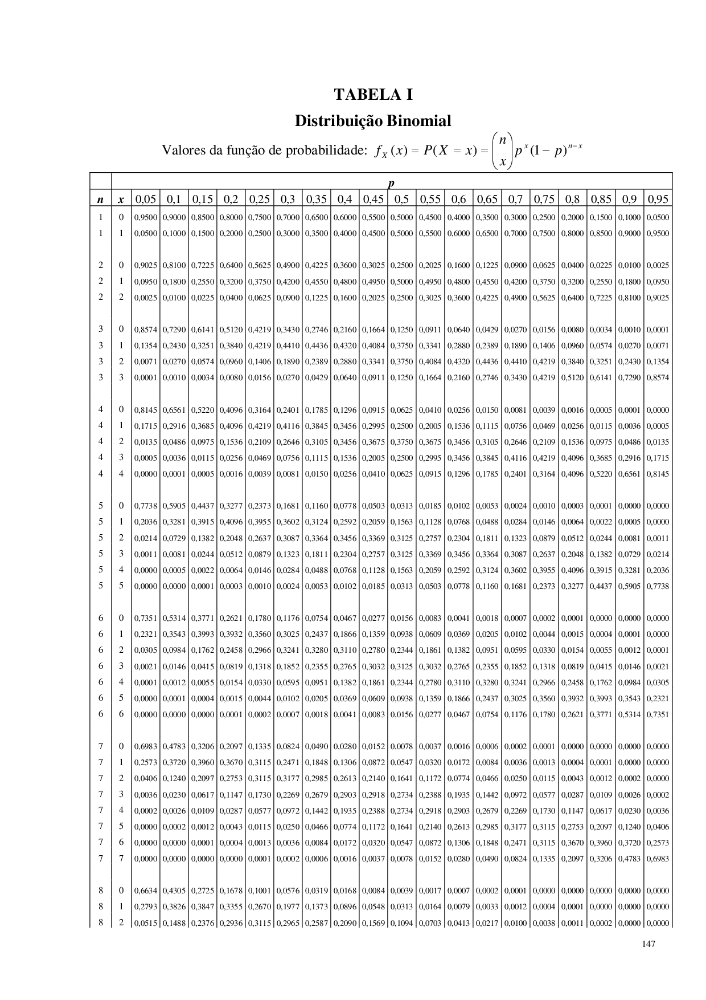

# Distribuição

- Usado principalmente na teoria da probabilidade
- Comportamento de dados aleatórios

*Exemplo 1*:

Variáveis = [12, 9, 10, 11, 8, 9, 10, 11, 10]

Um gráfico de frequência mostra a quantidade de vezes que dado número se repetiu.

A amostra apresentada acima, ficaria com um gráfico mais ou menos assim:

```
4.______________
3._____10_______
2.___9_10_11____
1._8_9_10_11_12_
```

Podemos descobrir por exemplo, que existe uma maior frequência de dados ao redor da média (conhecida como Distribuição Normal)

Ainda sobre os dados descobrimos que:

1. 68% dos dados estão a +-1 desvio padrão da média
2. 30% dos dados estão a +-2 desvio padrão da média
3. e etc...

## Distribuição Binomial

É uma distribuição de probabilidade discreta

### Pré requisitos

1. Número fixo de experimentos.
2. Cada experimento pode ter 2 resultados apenas: Sucesso ou Fracasso.
3. A probabilidade de sucesso deve ser a mesma em cada experimento.
4. Os experimentos são independentes.

*Exemplo 1*:

Se eu jogar uma moeda 5 vezes. Qual a probabilidade de dar cara 3 vezes?

1. Número fixo de experimentos. *SIM*
2. Cada experimento pode ter 2 resultados apenas: Sucesso ou Fracasso. *SIM*
3. A probabilidade de sucesso deve ser a mesma em cada experimento. *SIM*
4. Os experimentos são independentes. *SIM*

*Exemplo 2*:

Um cesto tem 10 frutas que pesam entre 3 e 5 quilos. Qual a probabilidade de eu retirar duas frutas, uma de 4 quilos e outra de 3 quilos?

1. Número fixo de experimentos. *SIM*
2. Cada experimento pode ter 2 resultados apenas: Sucesso ou Fracasso. *NÃO*
3. A probabilidade de sucesso deve ser a mesma em cada experimento. *NÃO*
4. Os experimentos são independentes. *NÃO*

Logo eu não posso resolver esse problema utilizando distribuição Binomial

### Convenções

1. X = Total de sucesso esperado do experimento
2. p = probabilidade de sucesso
3. n = número de experimentos
4. 1-p = probabilidade de fracassos

### Fórmula

f(x) = $\binom{n}{x}p^x(1-p)^{(n-x)}$

#### Exemplo 1

Se eu jogar uma moeda 5 vezes. Qual a probabilidade de dar cara 3 vezes?

- X = 3
- p = 0,5
- n = 5

```
*Fórmula*
f(x) = $\binom{n}{x}p^x(1-p)^{(n-x)}$

*Colocando os valores na Fórmula*
f(x) = $\binom{5}{3}(0,5)^3(1-0,5)^{(5-3)}$

*Calculando o binomio utilizando fatoriais para 5 e 3*
$\binom{n}{x} = \binom{5}{3} = \frac{5!}{3!(5-3)!} = \frac{120}{12}$ = 10

*Jogando o binomio calculado na formula*
$f(x) = 10 * (0,5)^3 * (1 - 0.5)^{(5-3)}$

*Resolvendo $p^x$*
$f(x) = 10 * 0.125 * (1 - 0.5)^{(5-3)}$

*Resolvendo as multiplicações*
$f(x) = 1.25 * (0,5)^2$

*Resolvendo a potência*
$f(x) = 1.25 * 0,25$

*Resultado*
$f(x) = 0,3125$
ou
$31.25%$
```

#### Exemplo 2

Se eu passar 4 sinais de quatro tempos cada. Qual a probabilidade de eu pegar: [0, 1, 2, 3 e 4] sinais verdes?

- X = 0, 1, 2, 3, 4
- p = 0.25
- n = 4

```
Resultados

[0] = 0.316406 ou 31.64%
[1] = 0.421875 ou 42.18%
[2] = 0.210938 ou 21.09%
[3] = 0.046875 ou 04.68%
[4] = 0.003906 ou 00.39%
```

### Exemplo 3

Se você fizer a prova de um concurso com 12 questões de múltipla escolha (4 alternativas cada questão). "Chutando" todas as quesões, qual a probabilidade de acertar 7 questões?

- X = 7 acertos
- p = 0,25
- n = 12

```
Resultado: 0.01147127 ou 1.14%
```

### Tabela de Distribuição



